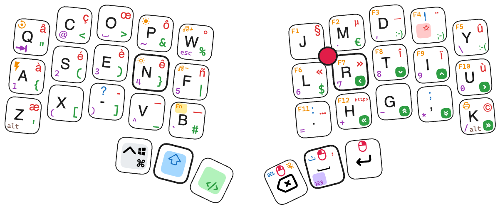
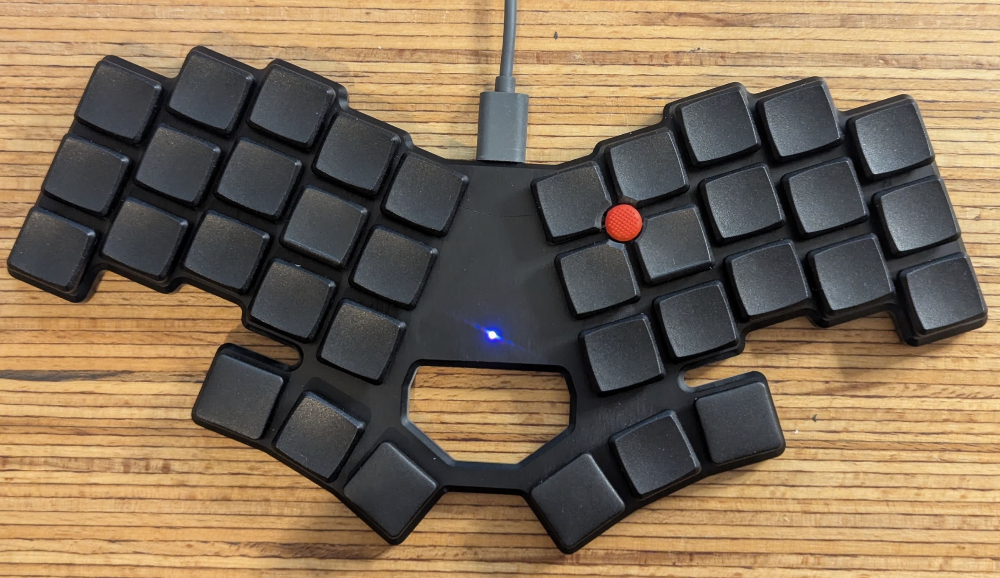
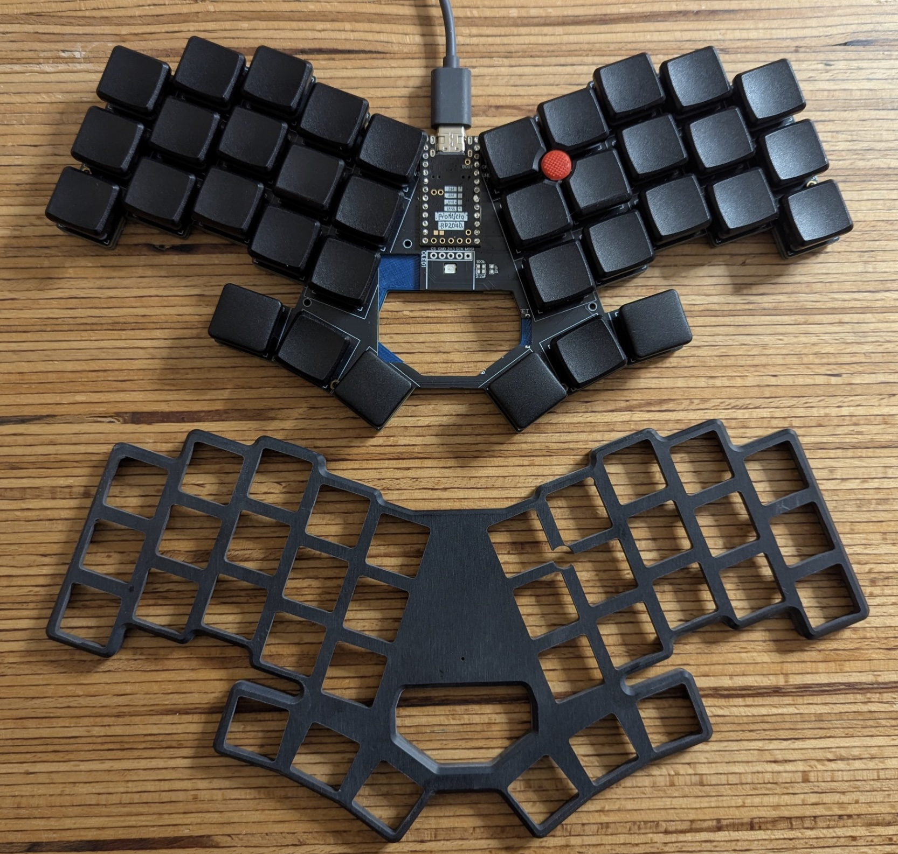
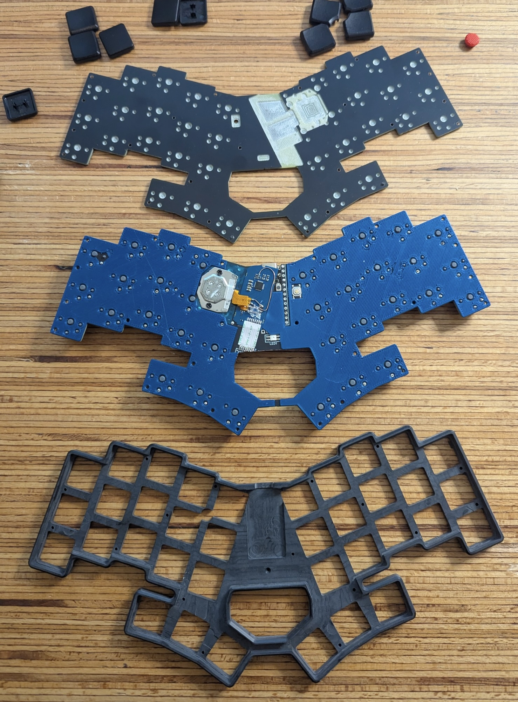

Wave36: Clavier custom 36 touches low-profile, layout "Ergo-L" (https://ergol.org), avec intégration d'un trackpoint PS2 d'un thinkpad Lenovo.

La configuration ergo-L est un peu spécifique pour ne pas nécessiter de driver (même portable) sur un PC ou sur un Mac (macro pour envoyer des combinaisons alt+xxx sous Windows, ou des séquences de touches sur un MacOS, tous les deux restants en configuration azerty au niveau de l'OS). Pas très élégant, mais permet de rester compatible avec des PC en mode 'non administrateur', avec des PC ou Mac familiaux sans avoir à expliquer comment remettre un clavier "normal" pour le reste de la famille, et aussi de se connecter sans soucis sur des serveurs virtualisés (note: pas de Ê sur un linux dans cette configuration!!)

Inspirations:
- Clavier split sous ZMK (un grand merci!): https://github.com/infused-kim/kb_zmk_ps2_mouse_trackpoint_driver
- Clavier de TeXitoi (magnifique!): https://github.com/TeXitoi/keymini
- mes précédants claviers...

PCB custom (impression JLCPCB) avec:
- place pour 36 touches type Kaihl Choc 1 (soudure directe sur le PCB, pour rester très mince)
- place pour un pro-micro (type rp2040 dans mon cas), ou un nice!nano
- 1 led RVB *ou* 1 nice!view (pin en commun, même localisation)
- 1 batterie en cas de montage avec un nano
- 1 emplacement pour un module PS2 de récup d'un clavier lenovo type X280 ou T490
(Montage actuel: RP2040, Led RGB et trackpoint PS2)

- Fond: PCB de mêmes dimmensions, usiné ensuite à la CNC pour décaisser les composants électroniques du PCB principal

- Boîtier: morceau de solid surface usiné dans la masse à la CNC (1j entier de boulot pour modéliser et usiner...)

Note:
- la led RGB consomme trop pour un montage avec batterie, mais le nice!view serait très bien
- consommation du module PS2 "modérée"... pourrait fonctionner avec ZMK sur batterie, mais durée de vie de la batterie estimée à 1 semaine max (pas encore essayé).
- le Corian noir est cassant... et mon boitier trop fin. En Blanc ça serait plus solie... à voir à l'usage!
- la soudure du module PS2 de récup nécessite une patiente infinie, ou une dextérité supérieure à la mienne... de belles heures de galère...
