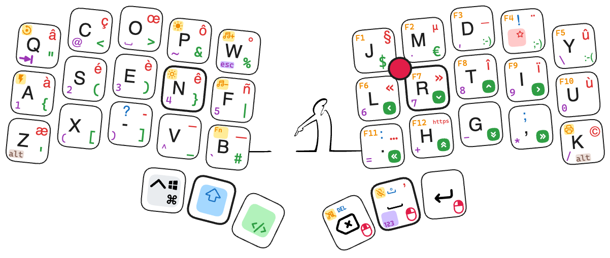

## Wave36

Clavier custom 36 touches low-profile, layout "Ergo-L" (https://ergol.org), avec intégration d'un trackpoint PS2 d'un thinkpad Lenovo.

La configuration ergo-L est un peu spécifique pour ne pas nécessiter de driver (même portable) sur Windows ou macOS (macro pour envoyer des combinaisons alt+xxx sous Windows, ou des séquences de touches sur un macOS, tous les deux restant en configuration azerty au niveau de l'OS). Code pas très élégant, mais permet de rester compatible avec des PC en mode 'non administrateur', avec des PC ou Mac familiaux sans avoir à expliquer comment remettre un clavier "normal" pour le reste de la famille, et aussi de se connecter sans soucis sur des serveurs virtualisés (note: pas de "Œ" sur un linux dans cette configuration!!)

Et petit clin d'œil à un ancien dessin animé (La Linéa)

**Inspirations :**
- Clavier split sous ZMK (un grand merci!): https://github.com/infused-kim/kb_zmk_ps2_mouse_trackpoint_driver
- Clavier de TeXitoi (magnifique!): https://github.com/TeXitoi/keymini
- mes précédents claviers...

PCB custom (impression JLCPCB) avec:
- place pour 36 touches type Kailh Choc 1 (soudure directe sur le PCB, pour rester très mince)
- place pour un pro-micro (type rp2040 dans mon cas), ou un nice!nano
- 1 led RVB *ou* 1 nice!view (pin en commun, même localisation)
- 1 batterie en cas de montage avec un nano
- 1 emplacement pour un module PS2 de récup d'un clavier lenovo type X280 ou T490

- Fond: PCB de même dimension, usiné ensuite à la CNC pour décaisser les composants électroniques (il reste 0.4mm d'époxy sous le trackpoint...)

- Boîtier: morceau de solid surface (V-Korr, identique au Corian) usiné dans la masse à la CNC. Dessin gravé puis colorisé au Posca

épaisseur totale: env 14.5mm

En cours d'étude:
- Version Wireless sous ZMK, mais soucis actuels avec le trackpoint sous ZMK :-(.

